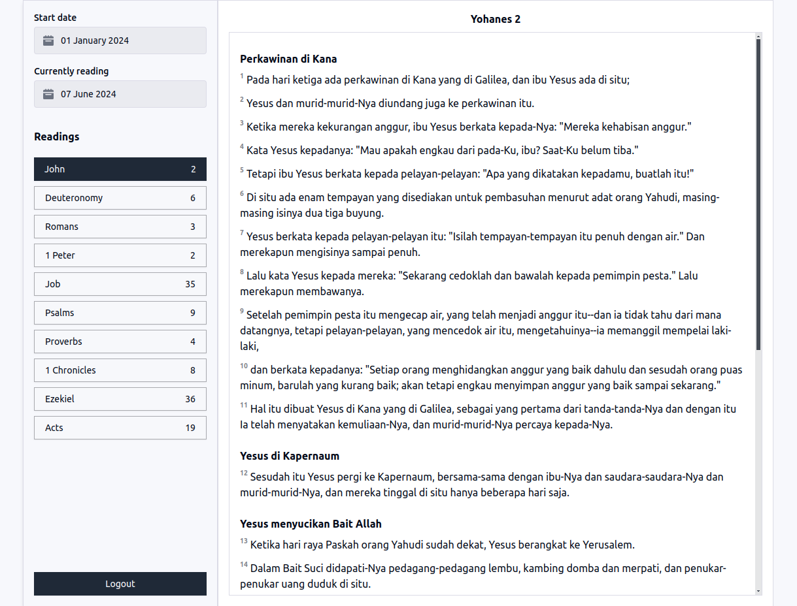

# Bible Reading Plan Web by Grant Horner

## Setup

1. `npm install`
1. Generate css:
   `npx tailwindcss -i ./assets/tailwind.css -o ./assets/dist/css/styles.css`
1. Install `sqlx` CLI if you havent. Run the migration:

   ```bash
    cp .env.example .env
    sqlx db create
    sqlx mig run
   ```

1. Run server:
   `cargo run`

## Written using the following library

1. [HTMX](https://htmx.org/)
1. [Alpine JS](https://alpinejs.dev/)
1. [Tailwind](https://tailwindcss.com/)
1. [Maud](https://maud.lambda.xyz/)

## Screenshots


